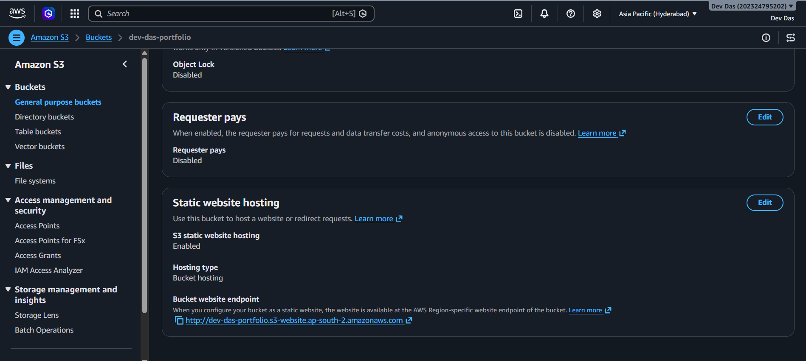
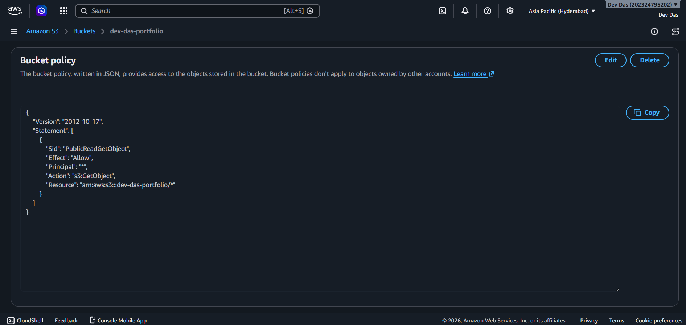
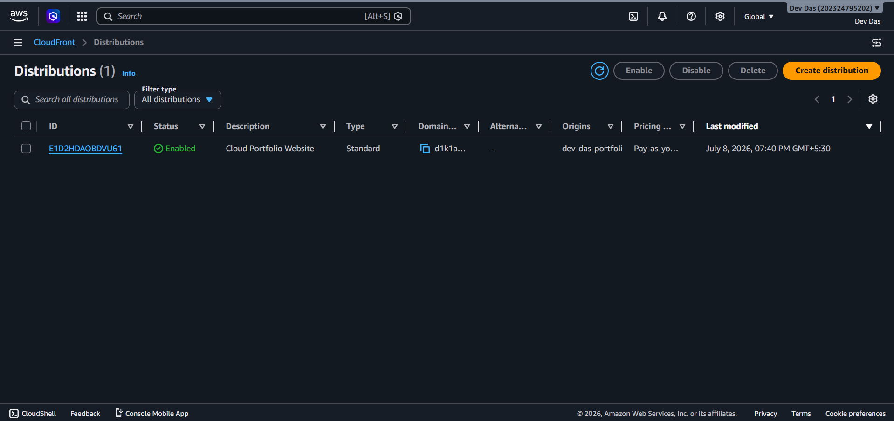
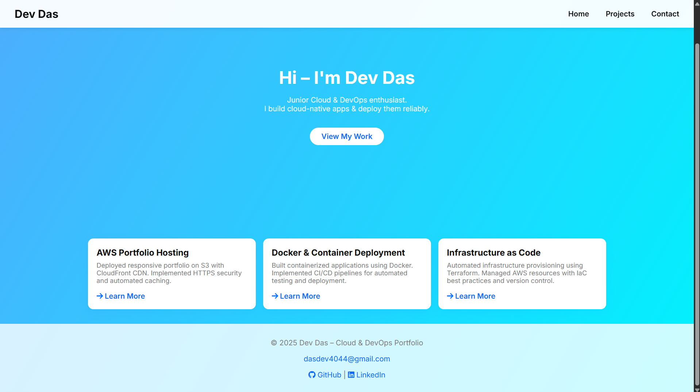
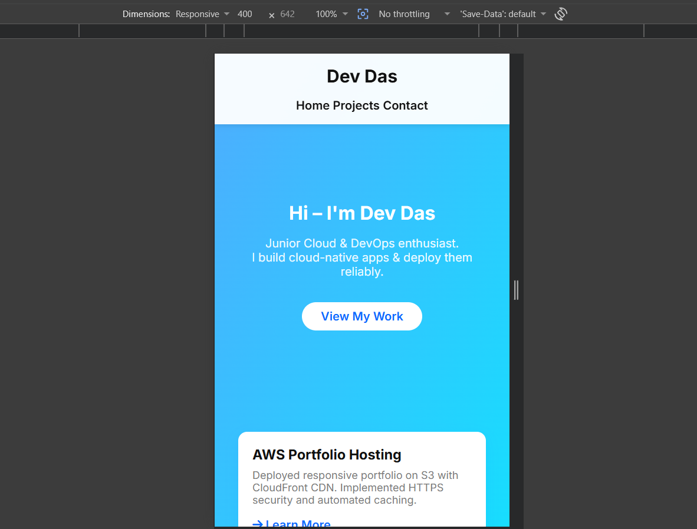
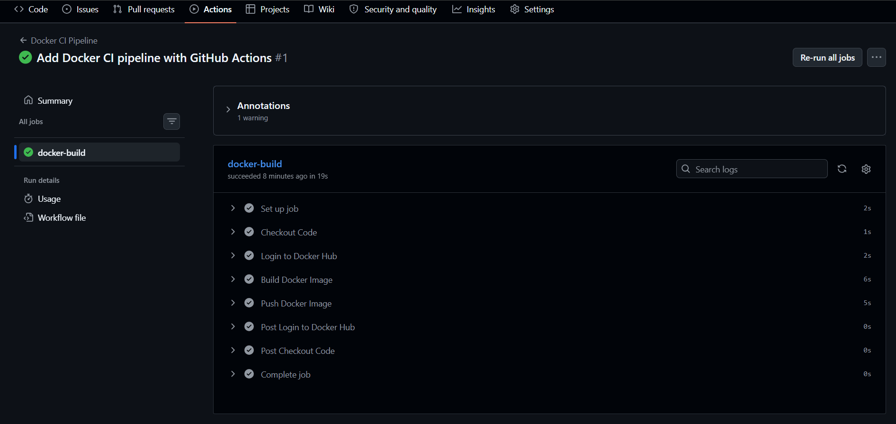
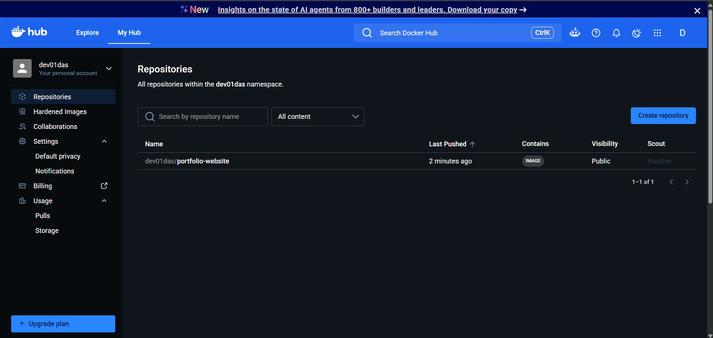
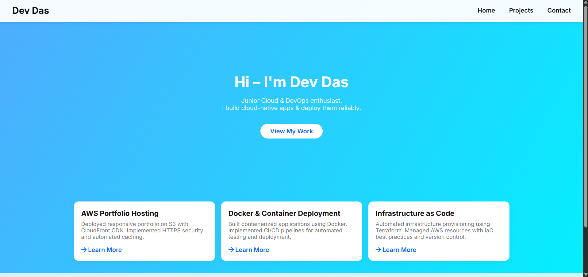

# My Cloud & DevOps Portfolio

A responsive portfolio website showcasing cloud infrastructure projects, hosted on **AWS S3 + CloudFront** with HTTPS security.

## 🌐 Live Site
https://d1k1ai6ec6j2dl.cloudfront.net/

## 📁 What's Inside
- **index.html** - Responsive HTML structure (Hero, Projects, Contact)
- **styles.css** - Modern CSS with gradient backgrounds and hover effects
- **assets/** - Images and icons

## 🛠️ Technologies Used
- HTML5 / CSS3
- AWS S3 (Object Storage)
- CloudFront CDN (Content Delivery)
- HTTPS (SSL/TLS via CloudFront)
- GitHub (Version Control)

## 🚀 How I Built This

### 1. Created Portfolio Website
- Responsive single-page design
- Google Fonts (Inter)
- FontAwesome icons
- Mobile-friendly CSS Grid

### 2. Uploaded to GitHub
```bash
git init
git add .
git commit -m "Initial portfolio setup"
git remote add origin https://github.com/dev-das-dd/portfolio.git
git push -u origin main
```

### 3. Hosted on AWS S3
- Created S3 bucket with static website hosting enabled
- Applied bucket policy to allow public read access
- Uploaded HTML, CSS, and assets

### 4. Secured with CloudFront + HTTPS
- Created CloudFront distribution with S3 as origin
- Enabled automatic HTTP → HTTPS redirect
- Set default root object to `index.html`

## 📝 Commands Used

```bash
# AWS CLI sync (optional - faster than console upload)
aws s3 sync . s3://dev-das-portfolio --acl public-read

# Check S3 bucket policy
aws s3api get-bucket-policy --bucket dev-das-portfolio
```

## 🔐 AWS Architecture
User Browser (HTTPS)
↓
CloudFront CDN (Caching, Edge Locations)
↓
S3 Bucket (Origin)
├── index.html
├── styles.css
└── assets/

## 📚 Learning Resources Used
- AWS S3 Static Website Hosting: https://docs.aws.amazon.com/AmazonS3/latest/userguide/WebsiteHosting.html
- CloudFront Developer Guide: https://docs.aws.amazon.com/AmazonCloudFront/latest/DeveloperGuide/Introduction.html
- YouTube: [Host Static Website on S3 + CloudFront](https://www.youtube.com/watch?v=K4JBbKx4v40)

## ✨ Key Features
✅ Responsive design (mobile, tablet, desktop)  
✅ HTTPS security (automatic redirect)  
✅ Global CDN distribution (fast load times)  
✅ Free tier eligible (no ongoing costs)  
✅ Version control with Git/GitHub  

## 🎓 What I Learned
- Cloud object storage (S3 bucket operations)
- IAM bucket policies and public access controls
- CDN concepts (caching, edge locations)
- HTTPS/SSL/TLS security
- Git workflow (init, commit, push)
- AWS console navigation and best practices

## 📸 Screenshots

### S3 Bucket Configuration


### S3 Bucket Policy


### CloudFront Distribution


### Live Website (Desktop)


### Live Website (Mobile)


## 💡 Next Steps
- Add custom domain (Route 53)
- Enable versioning on S3
- Set up automated deployments with GitHub Actions
- Add contact form with Lambda + SES
- Implement error logging with CloudWatch

---

**Deployed with ❤️ on AWS Cloud**

## Task 2: Docker Deployment

### Dockerized Version
- **Docker Image:** portfolio-website:latest
- **Web Server:** Nginx Alpine
- **Deployment:** AWS EC2 (t2.micro)
- **Live URL:** http://54.123.45.67
- **Container Port:** 80 (HTTP)

### Dockerfile Overview
Uses lightweight Nginx Alpine image with your website files.

### Deployment Steps
1. Clone repository
2. Build image: `docker build -t portfolio-website .`
3. Run container: `docker run -d -p 80:80 portfolio-website`

---

## ✅ Task 3: CI/CD Pipeline with GitHub Actions

### What I Built
Automated CI/CD pipeline that builds and pushes
Docker image automatically on every git push.

### Pipeline Flow
git push → GitHub Actions triggers
↓
Checkout code
↓
Login to Docker Hub
↓
Build Docker image
↓
Push to Docker Hub ✅

### Technologies Used
- GitHub Actions
- Docker Hub
- YAML Configuration
- GitHub Secrets

### Pipeline File
Located at: `.github/workflows/docker-ci.yml`

### Screenshots

#### ✅ GitHub Actions - Pipeline Success


#### 🐳 Docker Hub - Image Pushed Automatically


#### 🌐 Website Running from Auto-Built Image


### Docker Hub Image
```bash
docker pull dev01das/portfolio-website:latest
docker run -d -p 80:80 dev01das/portfolio-website:latest
```

### What I Learned
- ✅ CI/CD concepts and pipeline creation
- ✅ GitHub Actions workflow structure
- ✅ Automated Docker builds
- ✅ Secure secrets management
- ✅ Transition from manual to automated deployment
### CI/CD Benefits
- ✅ Automated builds (no manual work)
- ✅ Consistent image builds
- ✅ Secure credential handling (GitHub Secrets)
- ✅ Always deployment-ready
- ✅ Reduces human error